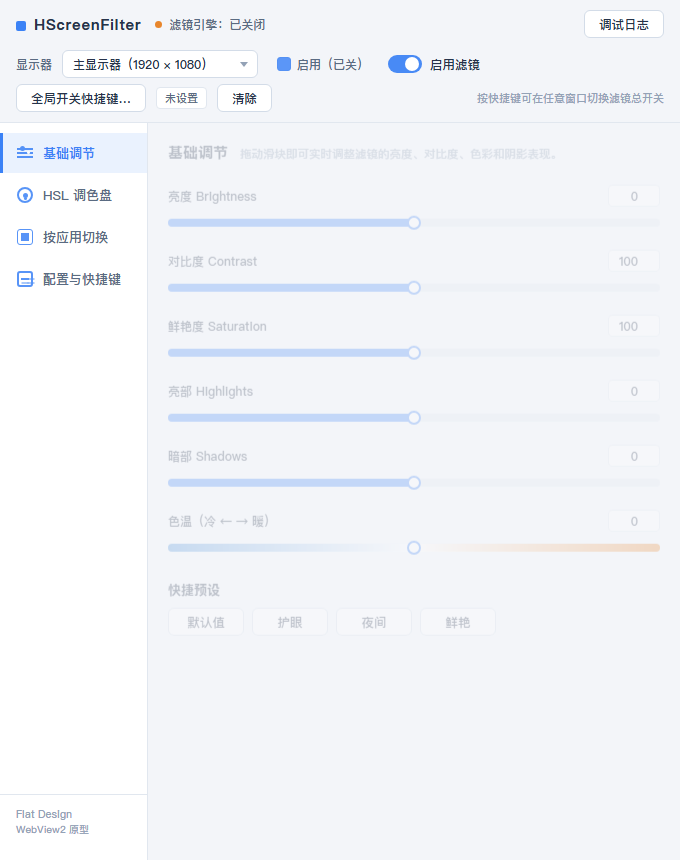
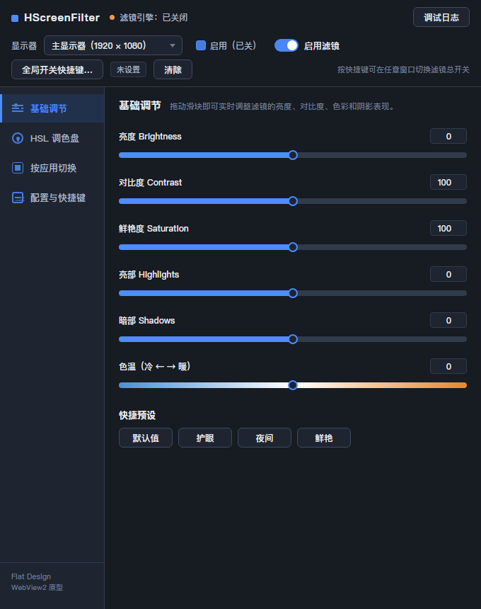
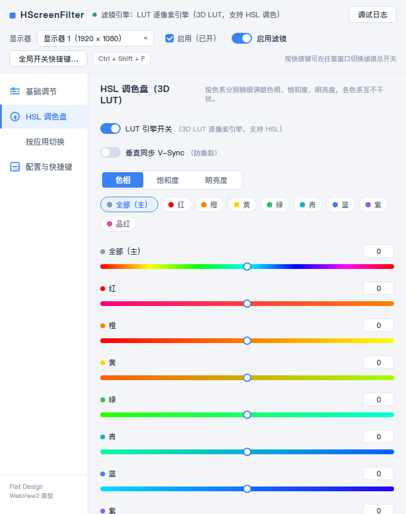
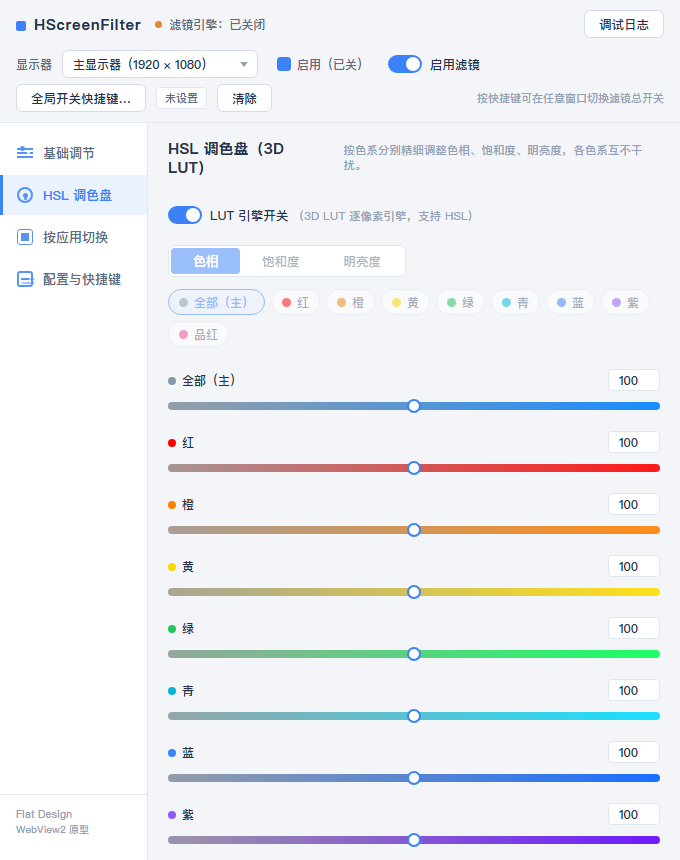
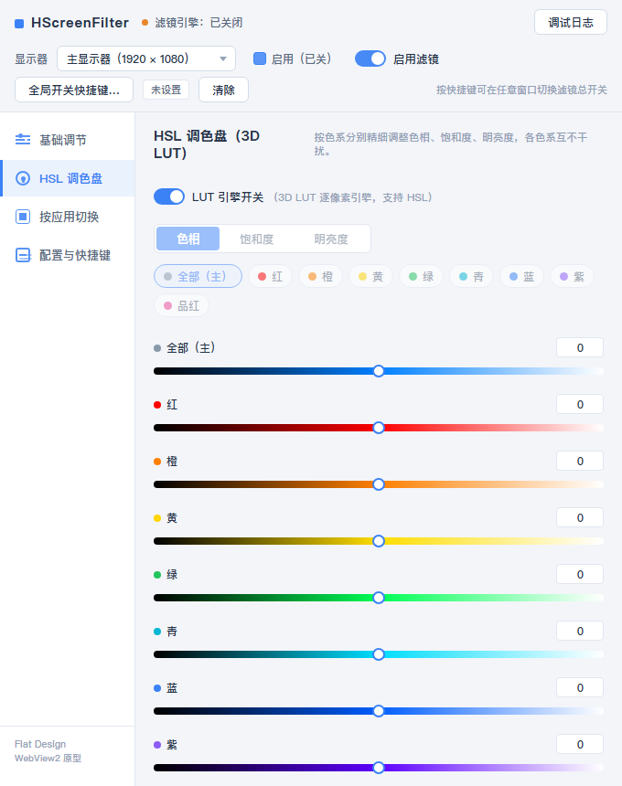
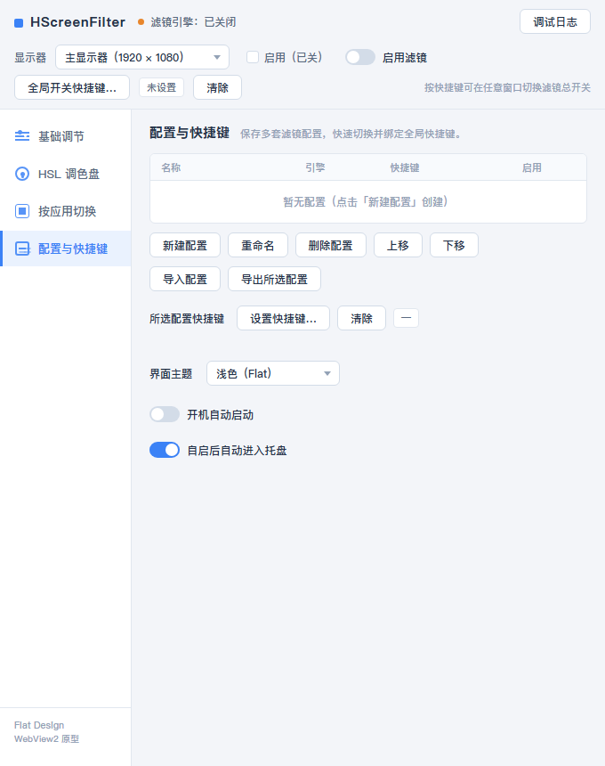

# HScreenFilter 屏幕滤镜 · v2.0.0-alpha

**WebView2 桥接版**：C++17 滤镜引擎 + Flat Design 网页 UI（Edge WebView2 承载），
滑块/开关实时驱动真实的滤镜引擎（3D LUT 逐像素 / 放大镜 / 伽马），数据与旧版完全兼容。

> **分支说明**
> - `main` — 当前版本：C++ 引擎 + WebView2 Flat Design UI（本仓库）
> - `legacy` — 原 C#/WinUI 3 版（完整历史与 v1.x 标签保留在 legacy 分支）
> - `dev` — 开发分支

## ✨ 功能

| 页面 | 功能 |
| --- | --- |
| **基础调节** | 亮度 / 对比度 / 鲜艳度 / 亮部 / 暗部 + 色温 滑块（数值可直接输入）+ 快捷预设（默认值/护眼/夜间/鲜艳，数值与原版一致） |
| **HSL 调色盘** | **全部（主）+ 红/橙/黄/绿/青/蓝/紫/品红** 9 通道，色相（全部 ±180° / 分色系 ±30°）/ 饱和度（0..200）/ 明亮度（±30）三字段，Photoshop 式渐变轨道 |
| **按应用切换** | 添加/编辑/删除检测应用、3 秒倒计时拾取前台应用、后台线程 500ms 轮询前台自动切换绑定配置或自动关闭 |
| **配置与快捷键** | 配置列表（名称/引擎/快捷键/启用，n选1）、新建/重命名/删除/导入/导出/上移/下移、每配置全局热键 + 全局开关快捷键（低级钩子捕获）、开机自启、自启进托盘 |

- **顶部常驻**：显示器选择 + 每显示器启用 + 滤镜总开关 + 全局开关快捷键（含清除）
- **托盘菜单**：启用滤镜（勾选）、全部配置列表切换、显示/退出；最小化/关闭进托盘
- **主题**：跟随系统 / 浅色 / 深色（Flat），保存提示「配置发生改变，是否保存至\n{配置名}」
- **窗口**：最小尺寸按系统缩放/工作区自适应（1080p 高缩放下自动缩小），可拉大

## 🖼️ 界面预览

| 浅色 | 深色 |
| --- | --- |
|  |  |

| HSL 色相轨道 | HSL 饱和度轨道 | HSL 明亮度轨道 | 配置页 |
| --- | --- | --- | --- |
|  |  |  |  |

## 🛠️ 技术要点

- **引擎**：64³ 3D LUT 管线（cs_5_0 计算着色器并行生成 LUT + 像素着色器三线性采样），
  HSL 软掩码 → OKLab 感知空间 → 暗部衰减，与旧版逐行一致；
  引擎回退链：LUT 逐像素 → 放大镜颜色矩阵 → 显卡伽马曲线。
- **UI**：WebView2 承载 webui2（HTML/CSS/JS，Flat Design），
  宿主 ↔ 页面通过 `PostWebMessageAsJson` / `postMessage` 双向桥接完整状态；
  滑块范围/预设/保存语义与原版严格一致。
- **数据**：`%LocalAppData%\HScreenFilter\profiles.json`，字段与原 C#/C++ 版完全兼容。

## 🔨 构建

前置：**便携 llvm-mingw 工具链**（`LLVM_MINGW` 环境变量）+ WebView2 SDK（`tools/webview2`，构建脚本自动部署）。

```powershell
.\build.ps1                  # 主程序（C++ 原生版，输出 build\HScreenFilter.exe）
.\build-webview2-demo2.ps1   # v2.0.0-alpha WebView2 版（输出 dist\HScreenFilter-v2.0.0-alpha\）
```

## 🚀 运行

```powershell
.\build\HScreenFilter.exe --selftest   # 主程序自检
dist\HScreenFilter-v2.0.0-alpha\webview2_demo2.exe   # WebView2 版（需系统已装 WebView2 Runtime）
```

## 📁 源码结构

```
src\
├── common.* / log.* / json.* / models.* / store.*   # 基础与数据（profiles.json 兼容）
├── autostart.* / monitors.* / msgwindow.* / hotkeys.* / fgwatcher.*
├── engines\
│   ├── hlsl.*                  # LUT 计算/采样着色器 + D3DCompile 封装
│   ├── lut_engine.*            # DXGI 覆盖层 + 桌面捕获 + 3D LUT 管线（主引擎）
│   ├── mag_engine.* / gamma_engine.* / filter_engine.*
├── ui\main_window.*            # C++ 原生版 UI（legacy 交互参照）
└── webview2_demo2.cpp          # v2.0.0-alpha WebView2 宿主（桥接引擎与页面）
webui2\                         # Flat Design UI（index.html / styles.css / app.js）
previews\                       # 界面效果图
```

## 📜 许可证

GPL-3.0。
