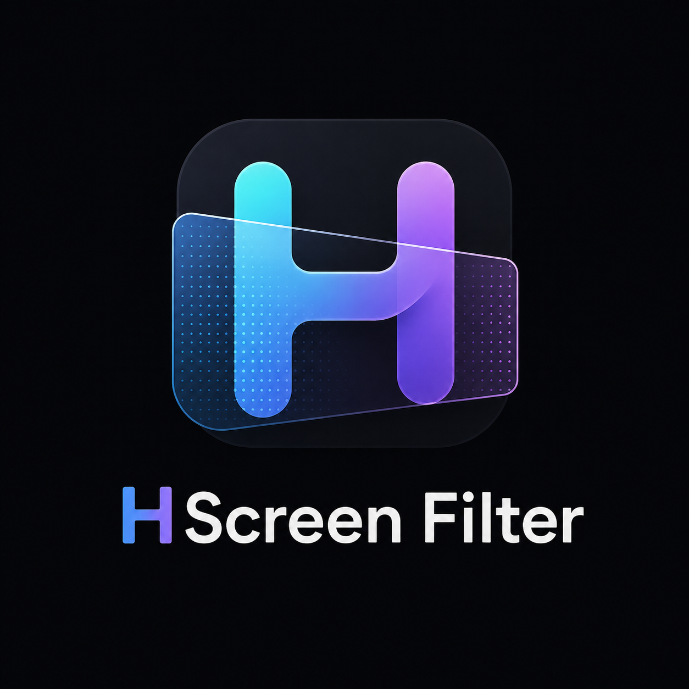

# HScreenFilter 屏幕滤镜

<p align="center">
  
</p>

一个基于 **WinUI 3** 的 Windows 屏幕滤镜工具，通过滑块实时调节屏幕的**亮度、对比度、鲜艳度、亮部、暗部**（附带色温与 **HSL 调色盘**），并支持**全局快捷键一键切换配置文件**。关闭窗口后驻留系统托盘，滤镜持续生效。

---

## ✨ 功能特性

| 功能 | 说明 |
| --- | --- |
| 🎚️ 五个核心滑块 | 亮度、对比度、鲜艳度（饱和度）、亮部、暗部，拖动即时生效 |
| 🌡️ 色温（附加） | 冷 ↔ 暖色调，适合护眼/夜间场景 |
| 🎨 HSL 调色盘 | 色相 / 饱和度 / 明度三根 Photoshop 式彩色滑块，精确调整整体色彩 |
| 📁 配置文件 | 保存/更新/删除/应用多套配置，一键切换 |
| ⌨️ 全局快捷键 | 每个配置可绑定一个全局热键（如 Ctrl+Alt+1），按下即切换；另有全局开关热键 |
| 🎯 按应用切换滤镜 | 只对指定前台应用启用滤镜，切到其它窗口时自动关闭（可按进程名或窗口标题匹配） |
| 🎨 快捷预设 | 标准 / 护眼 / 夜间 / 鲜艳 一键套用 |
| 🖥️ 系统托盘 | 关闭窗口最小化到托盘，滤镜保持生效；托盘菜单可退出 |
| 🚀 开机自启 | 可选开机自动启动 |

---

## 🚀 按应用切换滤镜

想让滤镜**只作用于某个应用**（例如只在浏览器或某个游戏里生效）时，可开启“启用按应用切换”：

1. 在“进程名”输入目标应用的进程名（不带 `.exe`，例如 `chrome` 或 `notepad`）。
2. 也可在“窗口标题”输入标题中包含的文字（可选，按标题子串匹配；与进程名二选一即可）。
3. 也可以直接点击 **“选择当前前台应用”**，自动填入当前位于前台的窗口。

开启后，仅当该应用位于前台时滤镜才开启，切到其它窗口会自动关闭。目标可通过进程名或窗口标题任一方式匹配，两者都为空则不会启用滤镜。

> 使用技巧：可以把“按应用切换”和“配置文件”“全局快捷键”结合使用，例如绑定一个快捷键在需要时快速启用——当目标应用不在前台时快捷键应用配置也不会立即生效，切到该应用后才开启。

---

## 🛠️ 技术原理

滤镜基于 **5×5 颜色变换矩阵**（MAGCOLOREFFECT）实现，通过 Windows 放大镜 API 的 MagSetFullscreenColorEffect 对整个桌面应用颜色效果：

- **鲜艳度**：围绕 Rec.709 灰度轴缩放色度（跨通道混合）。
- **对比度**：围绕 0.5 中灰缩放。
- **亮度**：加法偏移。
- **亮部 / 暗部**：亮部=乘法增益(gain)；暗部=保持白色的提亮(lift)。
- **HSL**：色相=标准 RGB 色相旋转；饱和度=围绕灰度轴缩放；明度=正值向白场混合（白场保持）、负值向黑场收缩（黑场保持）。三部叠加后一并合成进颜色矩阵。

> **引擎回退**：全屏颜色效果需要 **Windows 10 1903（build 18362）及以上**。若系统不支持，会自动回退到**显卡伽马曲线**（SetDeviceGammaRamp），此时鲜艳度与 HSL 调色盘不可用。

---

## 🔨 构建与运行

```powershell
.\build.ps1   # 构建 Release
.\run.ps1     # 运行
```

> 配置与当前状态保存在：%LocalAppData%\HScreenFilter\profiles.json

---

## 📜 许可证

本项目基于 **GPL-3.0** 许可协议开源，详见 LICENSE。